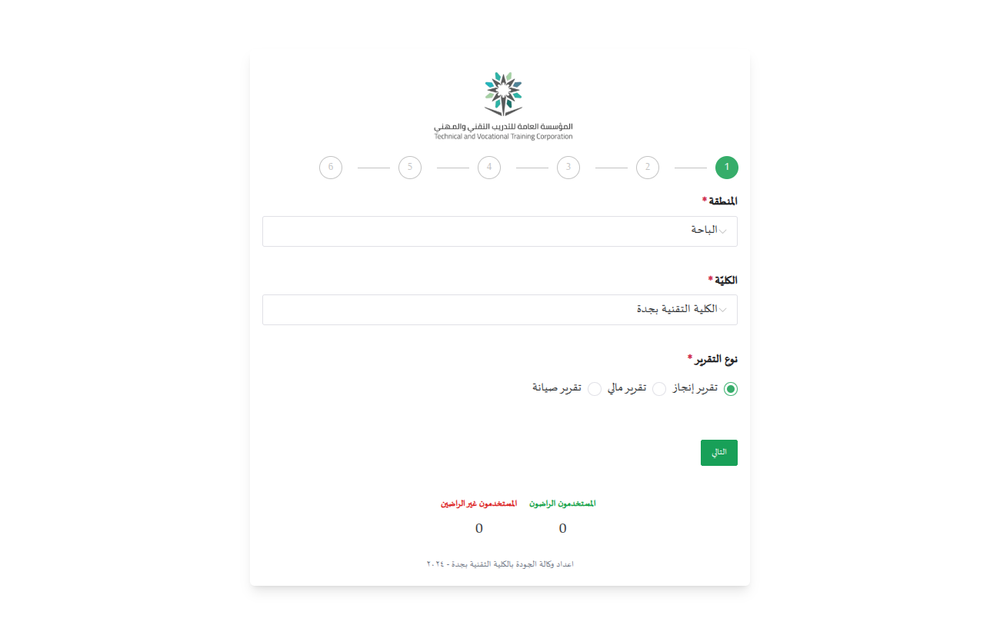
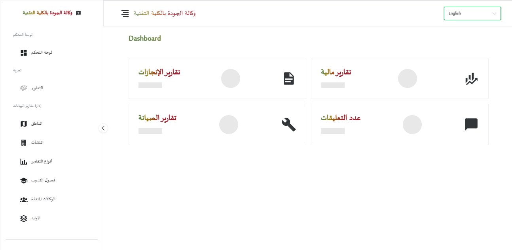
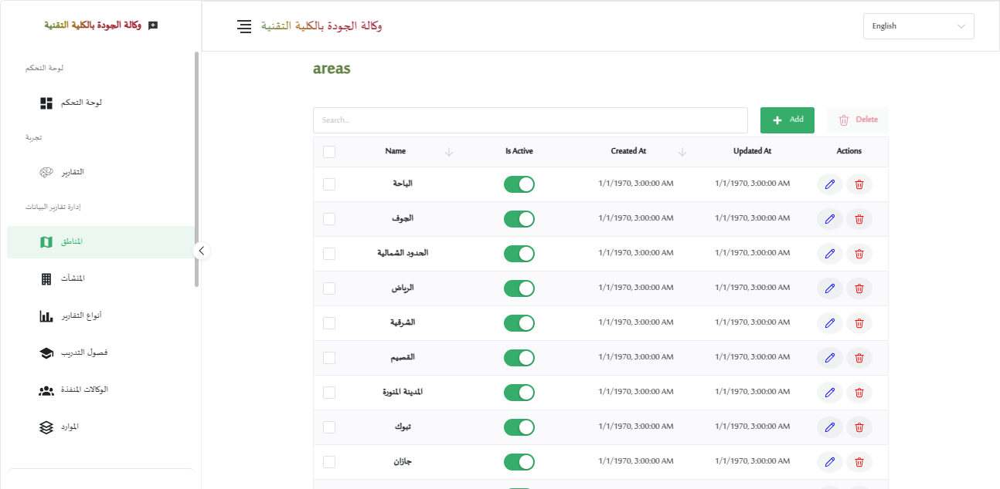

# Laravel Project Setup and Running Guide

This guide will walk you through the steps required to set up and run a Laravel project on your local machine, using **Yarn** for the Laravel backend and **PNPM** for the frontend.

---

## Features System

The project includes the following features:

1. **Two Separate Interfaces:**
   - **User Interface:** Designed to be simple and intuitive, allowing end-users to interact with the system seamlessly.
   - **Admin Interface:** Provides full control over data management and settings, with advanced tools for performance monitoring and decision-making.

2. **Process Evaluation Capability:**
   - Both users and admins can evaluate various processes, helping to improve efficiency and make informed decisions.

3. **Use of Modern Development Tools:**
   - The project is built using the latest technologies and development tools to ensure speed, security, and scalability for the future.

4. **Dashboard for Statistics Display:**
   - An interactive dashboard that visually displays key statistics and data, making it easy to track and analyze information.

5. **Flexible Data Visibility Control:**
   - Customizable data display options to suit your needs, providing great flexibility for future expansion.
   - Manageable data includes:
     - Data Report Management
     - Regions
     - Facilities
     - Report Types
     - Training Chapters
     - Implementing Agencies
     - Resources
     - Performance Indicators
     - Maintenance Types
     - Request Types
     - Maintenance Request Agencies
     - Departments

6. **Theme:**
   - A modern and flexible design that can be customized to match your brand identity.

7. **Arabic and English Language Support:**
   - The system supports both Arabic and English to cater to the needs of bilingual clients.

---

## Screenshots

Here are some previews of the key features and interfaces in the project:

### **Screenshot 1: User Interface**

- The user interface is designed to be clean and user-friendly, ensuring a seamless experience for end-users.

---

### **Screenshot 2: Admin Interface**

- The admin interface provides comprehensive tools for managing data, monitoring performance, and making informed decisions.

---

### **Screenshot 3: Dashboard**

- The dashboard offers an interactive and visually appealing way to display key statistics and data.

---

## Prerequisites

Ensure you have the following installed on your machine:

- **PHP** (version 7.4 or higher)
- **Composer** (for managing PHP dependencies)
- **Node.js** (for managing JavaScript dependencies)
- **Yarn** (for managing backend dependencies)
- **PNPM** (for managing frontend dependencies)
- **MySQL** or **SQLite** (for the database)
- **Apache**  (for serving the app, optional if using `artisan serve`)

---

## Step 1: Clone the Repository

Clone the Laravel project repository from GitHub (or any other source):

```bash
git clone https://github.com/mfoud444/reports_php.git
```

Navigate to the project directory:

```bash
cd reports_php
```

---

## Step 2: Set Permissions for Storage Directory

Run the following command to set the correct permissions for the `storage` directory:

```bash
sudo chmod -R 777 /opt/lampp/htdocs/reports_php/storage
```

---

## Step 3: Update `baseURLAPI` in `config.json`

1. Open the `config.json` file located in the root of the project.
2. Update the `baseURLAPI` field with your domain API URL. For example:

```json
{
  "baseURLAPI": "https://yourdomain.com/api"
}
```

3. Save the file.

---

## Step 4: Run the Setup Script

Run the `setup.sh` script to automate the setup process:

```bash
bash setup.sh
```

---

## Step 5: Install Project Dependencies

### Backend Dependencies (Laravel)

Install the required PHP dependencies using **Composer**:

```bash
composer install
```

For **Yarn**, run:

```bash
yarn install
```

This will install the backend dependencies for Laravel.

### Frontend Dependencies (PNPM)

Navigate to the frontend directory and install the frontend dependencies using **PNPM**:

```bash
cd frontend
pnpm install
```

---

## Step 6: Setup Environment Configuration

Copy the example environment configuration file:

```bash
cp .env.example .env
```

Open the `.env` file and set your database and other configurations (e.g., mail, caching, etc.):

```plaintext
DB_CONNECTION=mysql
DB_HOST=127.0.0.1
DB_PORT=3306
DB_DATABASE=your_database_name
DB_USERNAME=your_database_username
DB_PASSWORD=your_database_password


MAIL_FROM_ADDRESS=yourmail@example.com
MAIL_USERNAME=yourmail@example.com
MAIL_PASSWORD="your password"
```

---

## Step 7: Generate Application Key

Generate the application key using the Artisan command. This will set the `APP_KEY` in your `.env` file:

```bash
php artisan key:generate
```

---

## Step 8: Run Migrations

If your project includes a database, you need to run the migrations to create the necessary database tables:

```bash
php artisan migrate
```

If there are any seeders to populate the database with sample data, run:

```bash
php artisan db:seed
```

---

## Step 9: Run Frontend Application

To start the frontend application, go back to the **FrontendApp** directory and run the following:

```bash
pnpm serve
```

This will start the development server for the frontend, which can usually be accessed at `http://localhost:3000`.

---

## Step 10: Serve the Laravel Application

You can serve your Laravel application using the built-in development server or via Apache or Nginx.

### Option 1: Using Artisan's Development Server:

Run the following command:

```bash
php artisan serve
```

This will start the development server at `http://localhost:8000`.

### Option 2: Using Apache or Nginx:

If you wish to use Apache , configure your virtual host to point to the `public` directory of your Laravel project.

---

## Step 11: Access the Application

Once both the backend and frontend servers are running, visit the following URL in your browser:

```plaintext
http://localhost:8000
```

For the frontend:

```plaintext
http://localhost:3000
http://localhost:3000/admin
```

If you're using Apache or Nginx, navigate to your domain (`http://yourdomain.local`).

## Troubleshooting

If you encounter any issues during setup or running the application, try the following:

- **Clear application cache:**

```bash
php artisan cache:clear
php artisan config:clear
```

- **Re-run Composer and Yarn/PNPM:**

```bash
composer install
yarn install
pnpm install
```

